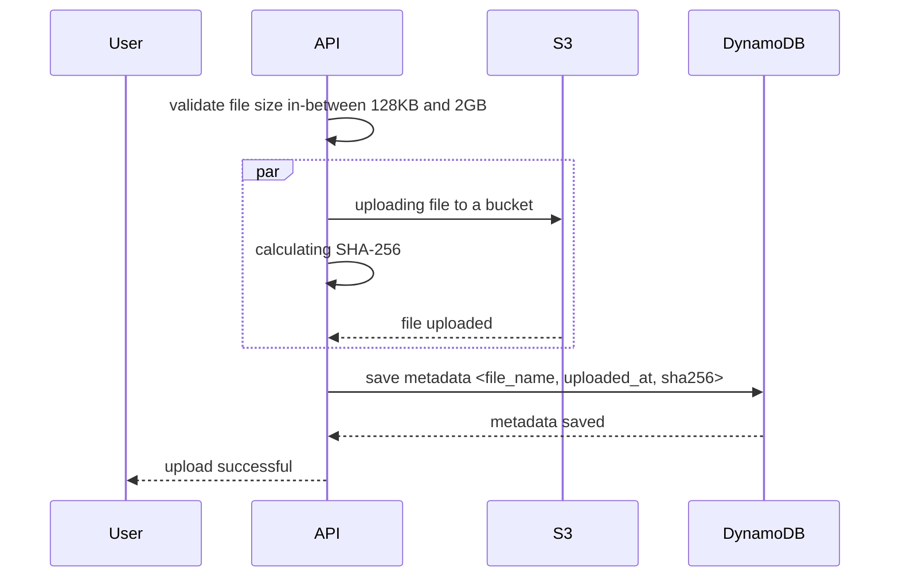

# File Storage System

## Introduction

This is a learning project, a small application that integrates AWS services using C#.
A simple file storage system which allow users to upload, retrieve, and list all stored files.


| Endpoint      | Description                                                                                                                                                                                                                                                                                                                                                                                                                                                                                                                                                                                                                                                                                                                                           |
|---------------|-------------------------------------------------------------------------------------------------------------------------------------------------------------------------------------------------------------------------------------------------------------------------------------------------------------------------------------------------------------------------------------------------------------------------------------------------------------------------------------------------------------------------------------------------------------------------------------------------------------------------------------------------------------------------------------------------------------------------------------------------------|
| Upload file   | As a user, I want to upload a file to S3 for long-term storage. The file can be any size from 128KB to 2GB. Unfortunately, I have a slow internet connection, and sometimes there might be network interruptions, but we should still be able to upload files efficiently. Along with uploading file, I want to calculate its SHA-256 value and store it in DynamoDB for further analysis, but kindly asking you to consider two important points:<br/>1. Memory used. We have small servers, and cannot have more than 2GB of memory on a server.<br/>2. By security reasons we cannot store the whole file in-memory of the application, let's say even minimum size files (128KB) should not be stored in-memory, even for a fraction of a second. |
| Download file | As a user, I want to download a file which was previously uploaded by me or any other user, and download process should be tolerable to network interruptions within 10 seconds, if possible.                                                                                                                                                                                                                                                                                                                                                                                                                                                                                                                                                         |
| List files    | As a user, I want to list all files, and find specific files using their SHA-256 values. The logic should be reliable in case file was deleted from S3 but DynamoDB record still exist, it's ok to have not consistent state for a short time, when file was deleted in the middle of the request.                                                                                                                                                                                                                                                                                                                                                                                                                                                    |


>Note: To view the diagram below, you may need to install the **Mermaid** plugin for your editor.



## Getting started

Pre-requirements:
- Docker
- .NET SDK 8.0+
- make
- jq

### Setup
To setup the project and all needed dependencies:

```sh
make up
```

To test if everything is ready (DynamoDB and S3 are created):

```sh
make check
```

If everything worked fine (localstack takes a bit time to prepare), you should see the following output from
`make check` command:
```
*** You might see your own AWS resources below, if you have localstack installed before ***
DynamoDB Table: Files
S3 Bucket: storage
FileStorage API: Healthy
*******************************************************************************************
```

### Additional Commands

To restart localstack resources (and empty them) as well as building the docker image for `filestorage-api` container
```sh
make reset
```

To stop all containers
```sh
make down
```

To check logs from containers
```sh
make logs
```

To check all stored S3 files and DynamoDB items
```sh
make storage
```

## Expectations
Please consider the following points:
- The code should be clean and easy to read
- The application should start in docker without manual changes
- Unit tests for core functionality are written and passing
- Your decisions are well documented in the code or in a readme file

## Submission
- You can submit your solution as a zip file or a link to a public repository to a hiring manager email

# Solution

## Run the application

- Clone the repository or unzip the file into a folder.
- Open a terminal at the directory and run command below to start up
```bash
make up
```
- If you don't have `make` installed, run
```bash
docker compose up
```
- Run check to test everything is ready
```sh
make check
```

## Unit test

- Navigate to FileStorage.UnitTests folder
```bash
cd FileStorage.UnitTests
```
- Run command
```bash
dotnet test
```
- You should see something like this
```
Starting test execution, please wait...
A total of 1 test files matched the specified pattern.

Passed!  - Failed:     0, Passed:    21, Skipped:     0, Total:    21, Duration: 10 s - FileStorage.UnitTests.dll (net8.0)
```

## Endpoints documentation

The local domain should be `http://localhost:8080`.
You can make multiple HTTP requests using terminal with curl or a third-party platform (example: [Postman](https://www.postman.com/)).

```
POST  |  /api/FileStorage/upload  |  Upload a file to S3 and save metadata to DynamoDB

REQUEST SCHEMA
Note:
- File size should range from 128KB to 2GB.
- You can upload multiple files at once, but the total size should not exceed 2BG.

RESPONSE SCHEMA
[
    {
        "message": string,
        "objectKey": string,
        "metadata": {
            "filename": string,
            "contentType": string,
            "size": uint,
            "sha256": string,
            "bucketName": string,
            "uploadedAt": datetime
        },
        "error": string
    }
]
```
---
```
GET  |  /api/FileStorage/download/{fileName}  |  Download a file from S3

RESPONSE SCHEMA
Binary file data
```
---
```
GET  |  /api/FileStorage/list |  List all file records in DynamoDB

RESPONSE SCHEMA
[
    {
        "Filename": string,
        "BucketName": string,
        "ContentType": string,
        "Size": string,
        "Sha256": string,
        "UploadedAt": datetime
    }
]
```
---
```
GET  |  /api/FileStorage/get/{sha256} |  Get specific record by it's sha256 value

RESPONSE SCHEMA
{
    "Filename": string,
    "BucketName": string,
    "ContentType": string,
    "Size": string,
    "Sha256": string,
    "UploadedAt": datetime
}
```
---
##### HTTP Response Status Codes used in this application

| Code  | Title                      | Description                              |
| ----- | -------------------------- | ---------------------------------------- |
| `200` | `OK`                       | When a request was successfully processed (e.g. when using `GET`, `PATCH`, `PUT` or `DELETE`). |
| `400` | `Bad request`              | When the request could not be understood (e.g. fail to validate or missing data). |
| `404` | `Not found`                | When URL is not found. |
| `413` | `Request Entity Too Large` | When your upload file is too big (e.g >2GB). |
| `500` | `Internal server error`    | When an internal error has happened (e.g. when trying to add records in the database fails). |